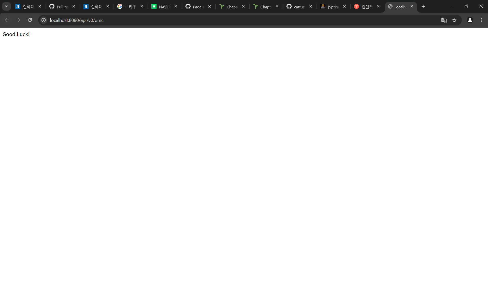

### 1. 너디너리 홈페이지 접속하는 과정 적어보기 (소켓프로그래밍과 같은 개념 없이 TCP, IP, PORT 등의 개념 등 오늘 배운 내용으로 간단하게 적어주세요)

1. 브라우저 검색창에 https://neordinary.co.kr 를 입력한다.
   - https는 443 포트로 정해져 있어 생략할 수 있다.

2. DNS(Domain Name System)를 통해 실제 IP 주소를 획득한다.
   - 우선적으로 브라우저 캐시, OS 캐시, 라우터 캐시를 확인하여 IP 주소롤 획득한다.
   - 캐시에 없다면 ISP(인터넷 서비스 제공업체)로 이동하여 DNS 기록을 요청한다.

3. TCP/IP 프로토콜을 사용하여 서버와 연결을 한다.
   - 클라이언트와 서버 간의 연결을 위해 3 way handshake라는 프로세스를 거친다.
   - 클라이언트의 syn 패킷 -> 서버의 syn/ack 패킷 -> 클라이언트의 ack 패킷

4. 브라우저가 웹 서버에 HTTP 요청을 한다.
   - 서버는 브라우저의 요청에 맞게 적절한 핸들러를 실행시켜 response를 생성한다.

5. 서버가 HTTP 응답을 보낸다.
   - 웹 페이지와 함께 상태 코드, 쿠키 등의 값을 포함하여 응답을 보낸다.
   - 2xx(Success), 3xx(redirect), 4xx(Client Error), 5xx(Server Error)의 상태코드로 표현한다.

6. 브라우저는 전달받은 응답을 통해 랜더링하여 너디너리 홈페이지를 출력해준다.

### 2. 깃허브 clone 받아서 실행하고 나온 페이지 스크린 샷 찍기

