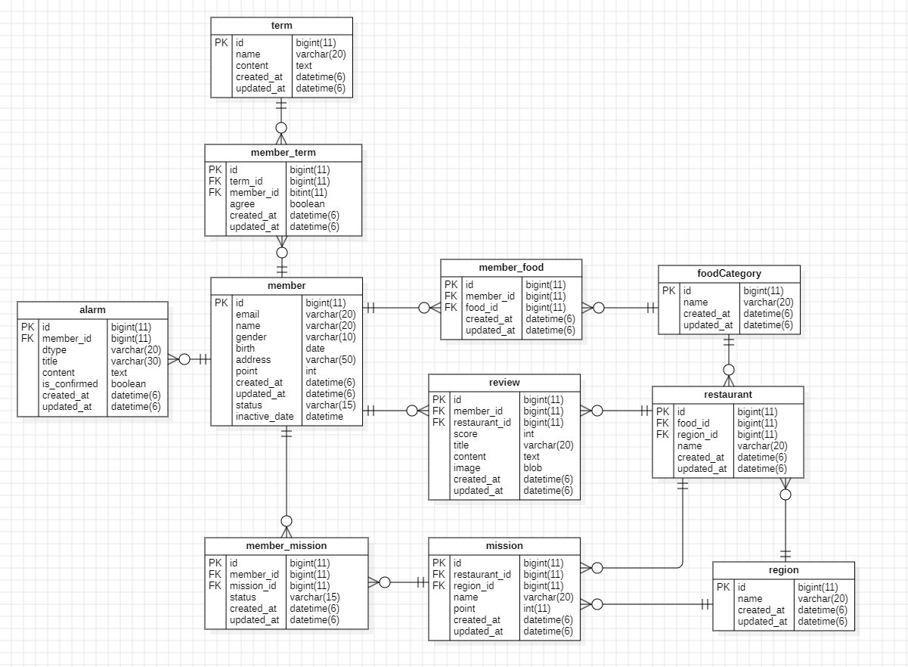

<hr>

## 1. 내가 진행중, 진행 완료한 미션 모아서 보는 쿼리(페이징 포함)
```mysql-sql
SELECT m.restaurant_id, r.name, m.name AS content, m.point, mm.status
FROM member_mission AS mm
JOIN mission as m ON m.id = mm.mission_id
JOIN restaurant as r ON r.id = m.restaurant_id
WHERE mm.member_id = :member_id AND mm.status = :status
ORDER BY mm.updated_at DESC
limit 5 offset (:page - 1) * 5;
```

## 2. 리뷰 작성하는 쿼리, 사진의 경우는 일단 배제
```mysql-sql
INSERT INTO review (
	member_id,
	restaurant_id,
	score,
	title,
	content
)
VALUES (
	:member_id,
	:restaurant_id,
	:score,
	:title,
	:content
);
```

## 3. 홈 화면 쿼리 (현재 선택 된 지역에서 도전이 가능한 미션 목록, 페이징 포함)
```mysql-sql
SELECT count(*)
FROM member_mission AS mm
JOIN mission AS m ON m.id = mm.mission_id
JOIN region AS r ON r.id = m.region_id
WHERE mm.member_id = :member_id AND mm.status = '완료' AND r.name = :지역명
```

```mysql-sql
SELECT m.id, r.name, m.name AS content, m.point
FROM mission AS m
JOIN restaurant AS r ON r.id = m.restaurant_id
WHERE m.id NOT IN (SELECT mission_id FROM member_mission WHERE member_id = :member_id)
ORDER BY m.created_at DESC
limit 5 offset (:page - 1) * 5;
```

## 4. 마이 페이지 화면 쿼리
```mysql-sql
SELECT name, email, point
FROM member
WHERE id = :id
```